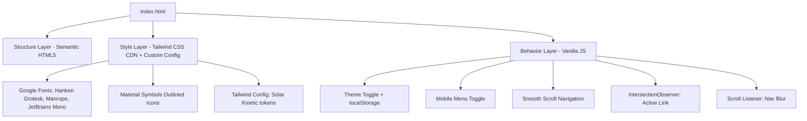

# Design Document: Solar Valley Energy Website

## Overview

The Solar Valley Energy website is a single-page marketing site built with vanilla HTML, Tailwind CSS (CDN), and minimal JavaScript. It follows the "Solar Kinetic" design system — a dark-mode-first, high-contrast aesthetic with sun-yellow (#F4B63F) accents on deep charcoal (#121414) backgrounds. The site communicates industrial-tech precision and environmental stewardship while generating leads through quote request CTAs.

The implementation is a single `index.html` file with inline Tailwind configuration, Google Fonts, and a small `<script>` block for interactivity. No build tools, frameworks, or package managers are needed.

### Key Design Decisions

| Decision | Rationale |
|----------|-----------|
| Single HTML file | Simplicity for a marketing site; no routing needed |
| Tailwind CSS via CDN | Rapid styling with utility classes, no build step |
| `class="dark"` on `<html>` | Tailwind dark mode strategy matching inspiration code |
| localStorage for theme | Persistence without backend; graceful fallback |
| Scroll-based JS (IntersectionObserver) | Performant active-link highlighting without scroll event polling |
| CSS transitions only | No animation libraries needed for 150-300ms hover/scroll effects |

---

## Architecture

The site is a single static HTML page with three logical layers:



### File Structure

```
/
├── index.html          # Complete single-page site
├── logo.png            # Company logo (from Inspiration/)
└── assets/             # (optional) local images if not using external URLs
```

### Rendering Flow

1. Browser loads `index.html`
2. Google Fonts load asynchronously (`display=swap`)
3. Tailwind CDN loads and applies utility classes
4. Custom `<script>` block in `<head>` sets `tailwind.config` with Solar Kinetic design tokens
5. On `DOMContentLoaded`, JS initializes: theme restoration, IntersectionObserver, scroll listener, mobile menu

---

## Components and Interfaces

### 1. Navigation Bar (`<header>`)

**Structure:** Fixed-position header with logo, nav links, theme toggle, and CTA button.

```
┌─────────────────────────────────────────────────────────────┐
│ [Logo]   Home | About | Solutions | Products | ...   [☀/🌙] [GET A QUOTE] │
└─────────────────────────────────────────────────────────────┘
```

**Behavior:**
- Fixed at top, 64px height, z-50
- Backdrop blur transitions from 0 → 12px after 50px scroll
- Active link gets 2px bottom border in #F4B63F (IntersectionObserver on sections)
- Below 768px: links collapse into hamburger menu → full-width dropdown panel

**Tailwind classes pattern (from inspiration):**
```html
<header class="fixed top-0 w-full z-50 bg-surface-container/90 border-b border-outline-variant h-16 transition-all duration-300">
```

### 2. Theme Toggle

**Structure:** Button within the nav bar displaying a sun/moon icon.

**Interface:**
```
toggle() → reads current theme → flips class on <html> → persists to localStorage
```

**States:**
- Dark mode (default): `<html class="dark">`, icon = sun
- Light mode: `<html class="">`, icon = moon

**localStorage key:** `"sv-theme"` with values `"dark"` | `"light"`

### 3. Hero Section (`<section>`)

**Structure:** Full-viewport section with background image + gradient overlay, left-aligned text content.

**Layout:**
- Min-height: 90vh (80vh on mobile)
- Gradient overlay: `linear-gradient(rgba(18,20,20,0.4), rgba(18,20,20,0.8))`
- Content: tagline label → headline → subtext → button group

### 4. Quick Stats Row (`<section>`)

**Structure:** Four feature items in a horizontal grid, separated from adjacent sections by 1px borders.

**Layout:** `grid-cols-1 md:grid-cols-4` with 24px gap

### 5. About Us Section (`<section>`)

**Structure:** Two-column layout (text left, images right) on desktop; single column on mobile.

**Layout:** `grid-cols-1 lg:grid-cols-2`

### 6. Solutions Grid (`<section>`)

**Structure:** Four service cards in a responsive grid.

**Layout:** `grid-cols-1 md:grid-cols-2 lg:grid-cols-4` with 24px gap

**Card anatomy:**
```
┌──────────────────┐
│ [Image 16:9]     │
├──────────────────┤
│ [Icon]           │
│ TITLE            │
│ Description text │
└──────────────────┘
```

**Hover:** Border transitions from outline-variant → primary within 200ms

### 7. Projects Section (`<section>`)

**Structure:** Scrollable grid of project items with navigation arrows.

**Layout:** `grid-cols-1 md:grid-cols-4` with arrow controls for horizontal scrolling

**Image hover:** `scale(1.05)` transform over 700ms ease-out

### 8. CTA Section (`<section>`)

**Structure:** Centered text block with two action buttons.

**Layout:** Centered, max-width constrained, buttons stack vertically on mobile.

### 9. Footer (`<footer>`)

**Structure:** Four-column grid (brand, quick links, contact, social/CTA) + copyright bar.

**Layout:** `grid-cols-1 md:grid-cols-4`

---

## Data Models

This is a static website with no dynamic data layer. All content is hardcoded in HTML. The only persisted state is:

### Theme Preference (localStorage)

| Key | Type | Values | Default |
|-----|------|--------|---------|
| `sv-theme` | string | `"dark"` \| `"light"` | `"dark"` |

### Navigation State (in-memory)

| Property | Type | Description |
|----------|------|-------------|
| `isMobileMenuOpen` | boolean | Whether the mobile dropdown is visible |
| `activeSection` | string \| null | ID of the currently active section |

---

## Error Handling

Given the static nature of the site, error handling is minimal but covers edge cases:

| Scenario | Handling |
|----------|----------|
| localStorage unavailable (private browsing) | Wrap in try/catch; default to dark mode; toggle works for session without persistence |
| Invalid localStorage value | If stored value is not `"dark"` or `"light"`, default to `"dark"` |
| Google Fonts fail to load | Fallback: `system-ui, sans-serif` for body/headings, `monospace` for labels |
| Tailwind CDN fails to load | Site degrades to unstyled semantic HTML (still readable) |
| Images fail to load | Use descriptive `alt` text; background images have gradient overlay ensuring text readability |
| JavaScript disabled | Theme defaults to dark (HTML has `class="dark"`); navigation links still work as anchor hrefs; no smooth scroll but browser native anchor behavior |
| IntersectionObserver not supported | Active link highlighting simply doesn't activate; fallback is no visual indicator (graceful degradation) |

---

## Testing Strategy

### Why Property-Based Testing Does Not Apply

This feature is a static marketing website with:
- No data transformations or algorithmic logic
- No parsers or serializers
- No input/output functions with varying behavior across inputs
- Pure UI rendering and simple DOM interactions

There are no universally quantified properties to test. Testing focuses on example-based verification, visual checks, and accessibility compliance.

### Testing Approach

#### 1. Manual Visual Testing
- Verify each section matches the Solar Kinetic design system specifications
- Compare rendered output against inspiration HTML reference files
- Check responsive breakpoints at 320px, 768px, 1024px, and 1440px widths

#### 2. Cross-Browser Testing
- Chrome, Firefox, Safari, Edge (latest versions)
- Mobile Safari (iOS) and Chrome (Android)
- Verify backdrop-filter support and fallback behavior

#### 3. Accessibility Testing
- Validate semantic HTML structure (headings hierarchy, landmarks)
- Test keyboard navigation through all interactive elements
- Verify focus indicators are visible on all buttons and links
- Test with screen reader (VoiceOver/NVDA) for alt text and ARIA labels
- Verify color contrast ratios meet WCAG 2.1 AA (4.5:1 for body text, 3:1 for large text)
- Verify touch targets are 44×44px minimum on mobile

#### 4. Functional Testing (Example-Based)
- **Theme toggle:** Click toggles dark ↔ light; persists across page reload; defaults to dark when localStorage is empty
- **Mobile menu:** Hamburger opens/closes dropdown; links close menu on click
- **Smooth scroll:** Clicking nav link scrolls to correct section
- **Active link:** Scrolling to each section highlights the corresponding nav link
- **Nav blur:** Scrolling past 50px activates backdrop blur on navigation
- **CTA buttons:** Hover states activate within timing specs; active/press states scale correctly
- **Card hover:** Border color transitions on solutions cards
- **Image hover:** Scale transform on project images
- **Footer links:** All quick links scroll to correct sections; social links open in new tabs

#### 5. Performance Testing
- Lighthouse audit targeting 90+ on Performance, Accessibility, Best Practices, SEO
- Verify font loading doesn't cause layout shift (FOIT/FOUT handled by `display=swap`)
- Check total page weight stays under 2MB (excluding external images)

#### 6. Responsive Layout Testing
- Verify 12/8/4 column grid transitions at breakpoints
- Verify no horizontal overflow at any viewport width
- Verify content reflow maintains source order on mobile
- Verify section spacing adapts between desktop (80-120px) and mobile (48-80px) ranges
